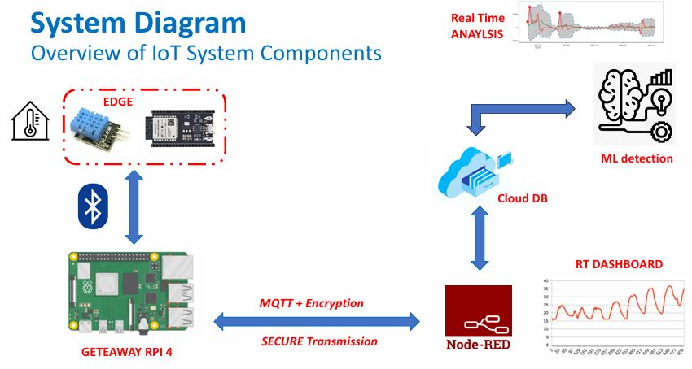
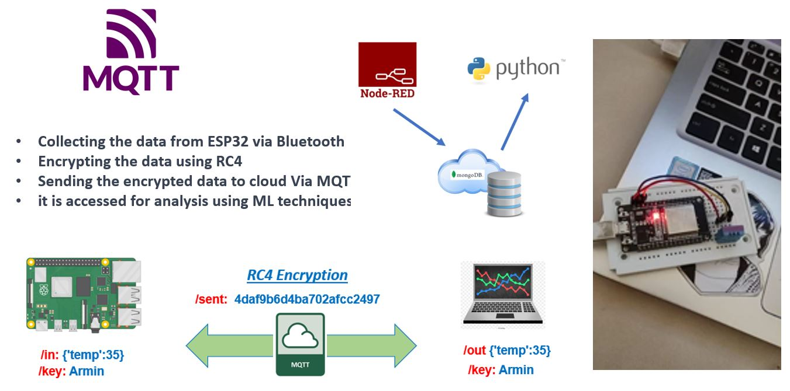
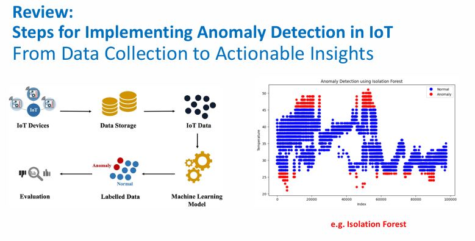

# Temperature Anomaly Detection in IoT Devices Using Machine Learning

## Overview

This project focuses on detecting anomalies in temperature data collected from IoT devices. It uses a combination of hardware and software components to collect, transmit, and analyze temperature data. The goal is to identify anomalies in real-time using machine learning algorithms.

## Project Components

1. **Hardware**:
   - **ESP32**: Used for collecting temperature data from the DHT11 sensor.
   - **Raspberry Pi**: Acts as a gateway to collect data from multiple ESP32 devices and transmit it to the cloud.

2. **Software**:
   - **Arduino IDE**: For programming the ESP32 to read data from the DHT11 sensor and send it via Bluetooth.
   - **Node-RED**: For visualizing data and decrypting information received from the cloud.
   - **MongoDB**: For storing data in the cloud.
   - **Google Colab/Python**: For applying machine learning algorithms to detect anomalies in the data.

## Steps

### 1. Data Collection and Transmission

- **ESP32 and DHT11 Sensor**: The ESP32 reads temperature data from the DHT11 sensor. This data is transmitted to the Raspberry Pi via Bluetooth.
- **Arduino IDE**: The ESP32 is programmed using the Arduino IDE. It reads data from the sensor and sends it via Bluetooth using two programs: one in C and one in Python, utilizing the Bluepy library.
- **Raspberry Pi**: The Raspberry Pi receives the data from the ESP32, encrypts it using the RC4 algorithm, and sends it to the cloud using the MQTT protocol. 

### 2. Data Visualization

- **Node-RED Dashboard**: The data is decrypted in Node-RED and visualized in real-time. A gauge represents the current temperature, and a chart displays the temperature trend over time.
- **Node-RED Library**: Install the necessary libraries in Node-RED to set up the user interface.

### 3. Data Storage

- **MongoDB**: Data is stored in a MongoDB cloud database as JSON. After creating a collection on MongoDB, data can be stored and retrieved as needed.

### 4. Anomaly Detection

- **Machine Learning**: In the Google Colab environment, data is read using Python and analyzed using machine learning algorithms. The Isolation Forest algorithm is used to detect anomalies in the temperature data. This algorithm is unsupervised and does not require labeled data.
- **Implementation**: The system operates in pseudo-real time. Every 10 seconds, data is read from the database, and the machine learning algorithm performs anomaly detection.

### 5. Security

- **Encryption and Decryption**: To ensure security, data is encrypted before sending to the MQTT servers and decrypted upon receipt. The RC4 algorithm is used for both encryption and decryption. The relevant codes are `Encrypt.py` and `Decrypt.py`.

## File Structure

- **sendToCloud.py**: Contains the code for encrypting and sending data to the cloud.
- **Encrypt.py**: Handles encryption of data.
- **Decrypt.py**: Handles decryption of data.
- **final_nodered**: Contains the Node-RED blocks for visualization and data processing.

## Installation and Setup

1. **Install Node-RED and Required Libraries**:
   - Follow Node-RED installation instructions.
   - Install the necessary Node-RED libraries for visualization and cloud communication.

2. **Set Up MongoDB**:
   - Create a MongoDB cloud account and set up a collection.

3. **Deploy Machine Learning Model**:
   - Use Google Colab to deploy and test the machine learning model for anomaly detection.

4. **Program the ESP32**:
   - Use the Arduino IDE to upload the code for data collection and Bluetooth transmission.

5. **Configure the Raspberry Pi**:
   - Install necessary libraries and run the `sendToCloud.py` script to handle data encryption and transmission.

## Usage

1. **Start the ESP32 and Raspberry Pi**: Ensure both devices are powered and properly connected.
2. **Monitor Data in Node-RED**: View real-time data and trends on the Node-RED dashboard.
3. **Analyze Anomalies**: Check the results of anomaly detection in Google Colab.

## License

This project is licensed under the MIT License. See the [LICENSE](LICENSE) file for details.

## Acknowledgments

- Node-RED
- MongoDB
- Google Colab
- The authors of the RC4 algorithm and Isolation Forest algorithm
